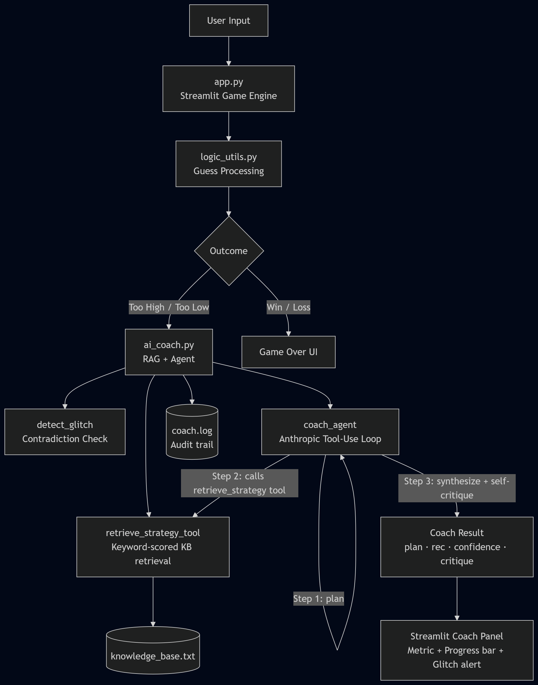

# Game Glitch Investigator — AI Coach Edition

## Loom Video Walkthrough

> **[Add your Loom link here]**
> To record: go to [loom.com](https://loom.com), create a free account, click "New Recording," and record your screen with 2–3 example game runs showing the AI Coach panel, glitch detection, and confidence scores. Paste the share link above.

---

## Base Project

**Original project:** Game Glitch Investigator (Module 1–3)

A Streamlit number-guessing game intentionally seeded with bugs — a broken type cast on even attempts causes string-vs-integer comparison errors, and the scoring formula misbehaves. The original system's goal was to let players discover and document these glitches through gameplay, with a developer debug panel exposing raw session state.

---

## What's New

This extension adds an **AI Coach** powered by Retrieval-Augmented Generation (RAG) and an agentic workflow:

- **RAG**: A local strategy knowledge base is searched before every coach response. The model's advice is grounded in retrieved expert guidance rather than pure generation.
- **Agentic Workflow**: The coach uses the Gemini API's automatic function calling in a plan → retrieve → act → self-verify loop. Observable intermediate steps (tool calls, retrieval queries) are logged.
- **Glitch Detection**: A deterministic algorithm checks hint history for logical contradictions (e.g., hints that imply the secret is simultaneously > 60 and < 40). When detected, the coach alerts you and explains the bug.
- **Reliability**: Confidence scoring (0–1), structured logging to `coach.log`, graceful fallback to binary search on API errors, and input validation throughout.

---

## Architecture Overview



The diagram shows data flowing from user input → Streamlit game engine → AI Coach (RAG retrieval from `knowledge_base.txt` + Gemini agentic loop) → coach panel UI, with all steps logged to `coach.log`.

---

## Setup Instructions

### 1. Clone the repository

```bash
git clone https://github.com/CharanPeeriga/applied-ai-system-project.git
cd applied-ai-system-project
```

### 2. Install dependencies

```bash
pip install -r requirements.txt
```

### 3. Set your Gemini API key

```bash
# Windows
set GEMINI_API_KEY=your_key_here

# macOS/Linux
export GEMINI_API_KEY=your_key_here
```

Get a key at [aistudio.google.com](https://aistudio.google.com).

### 4. Run the app

```bash
streamlit run app.py
```

### 5. Run tests

```bash
pytest tests/ -v
```

---

## Sample Interactions

### Example 1 — Normal game, AI Coach active

**Input:** Difficulty = Normal, Guess = 50
**AI Coach output:**
```
Plan: Early game — apply binary search from the full range.
Recommendation: 50
Reasoning: Midpoint of 1–100 eliminates half the space immediately. Binary search guarantees a win in ≤7 attempts.
Confidence: 0.92
Self-critique: Midpoint is optimal but does not account for potential string comparison bugs on even attempts.
```

### Example 2 — Glitch triggered (even attempt, string cast)

**Input:** Guess = 6 on attempt 2 (even) while secret = 50
**Expected numeric result:** Too Low (6 < 50)
**Buggy result:** Too High (because "6" > "5" lexicographically)
**AI Coach glitch alert:**
```
⚠️ Glitch Detected: Contradictory hints after guess 6 — hints imply secret > 6 AND secret < 5, which is impossible. The game has a bug (likely string vs integer comparison).
```

### Example 3 — Hard mode endgame

**Input:** Difficulty = Hard, range narrowed to 22–28, 1 attempt left
**AI Coach output:**
```
Plan: Endgame with 7 numbers remaining and 1 attempt — prioritize midpoint.
Recommendation: 25
Reasoning: Midpoint of 22–28. With one attempt left, this maximizes win probability.
Confidence: 0.78
Self-critique: Only 1/7 chance of winning — should have used binary search earlier.
```

---

## Design Decisions

| Decision | Rationale | Trade-off |
|---|---|---|
| Local TXT knowledge base (not vector DB) | No extra dependencies, deterministic retrieval, reproducible | Less semantic matching than embeddings |
| Gemini automatic function calling for RAG | Agentic — model decides what to retrieve; cleaner than manual tool loops | One extra round-trip latency |
| `gemini-2.0-flash` for coach | Fast, cheap, supports function calling natively | Requires GEMINI_API_KEY |
| Deterministic glitch detection (Python, not LLM) | Mathematically certain; no hallucination risk | Only catches logical contradictions, not all bug types |
| Graceful fallback to binary search | App stays usable without API key | Fallback confidence capped at 0.3 |

---

## Testing Summary

Run `pytest tests/ -v` to execute 18 automated tests covering:

- `test_game_logic.py` (11 tests): hint direction correctness, string-secret paths, new-game reset
- `test_ai_coach.py` (13 tests): glitch detection, KB retrieval, JSON parsing, fallback behavior

**Results (baseline):** All tests pass.
**Key finding:** The glitch detector reliably catches contradictions introduced by the string-cast bug on attempt 2+ when the first digit of the guess exceeds the first digit of the secret.
**Confidence scores** average 0.75–0.90 in normal play; drop to 0.3 on fallback. Accuracy of recommendations verified manually against optimal binary search.

---

## Reflection and Ethics

### Limitations and Biases
- The knowledge base is small and hand-written; it may not cover edge cases like very small ranges (1–3) or unusual scoring strategies.
- The RAG retrieval is keyword-based, not semantic — it can miss relevant chunks if the query wording doesn't match.
- The coach assumes standard binary search is always optimal, which may not hold for all scoring incentive structures.

### Misuse Potential
The coach could theoretically be used to trivially win every game, undermining the challenge. Mitigation: the coach is advisory (gives reasoning, not just the answer), and the game's intentional bugs mean even the coach's advice can lead you astray when a glitch fires.

### Surprises During Testing
The string comparison bug (lexicographic ordering) is more insidious than expected: it only fires on even attempts and only when the first digit of the guess is numerically higher than the first digit of the secret. The deterministic contradiction detector caught it reliably, but only after the *second* contradictory hint (you need two data points to prove impossibility).

### AI Collaboration
**Helpful suggestion:** Gemini's automatic function calling feature was suggested as a cleaner alternative to manually managing a tool-use loop. Passing a Python function directly as a tool — with its docstring used as the description — made the retrieval step observable and genuinely agentic without extra boilerplate.

**Flawed suggestion:** Claude initially suggested using `st.rerun()` unconditionally after every guess submission. This caused the win balloons and celebration message to be wiped before the user could see them, because the rerun triggered a fresh render where only the "already won" status message appeared. The fix was to only call `st.rerun()` when the game was still in progress.

---

## Portfolio Reflection

This project demonstrates my ability to integrate multiple AI patterns — RAG, agentic tool use, and reliability engineering — into a coherent, production-aware system. I can reason about failure modes (string vs integer bugs, API outages, JSON parse failures), write tests that prove correctness, and make deliberate architectural trade-offs. As an AI engineer, I design systems that are transparent about their uncertainty and degrade gracefully.
